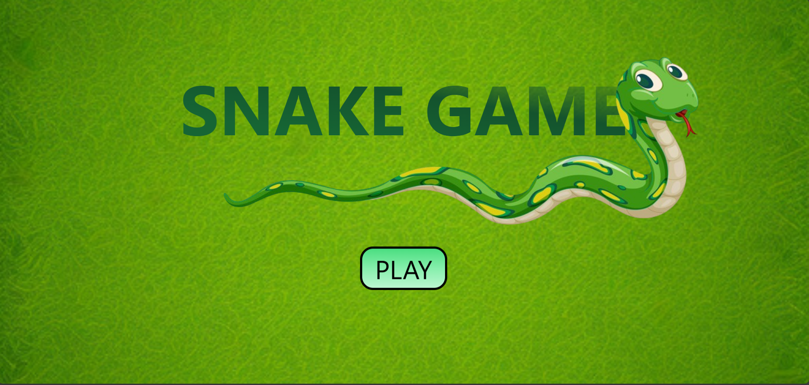
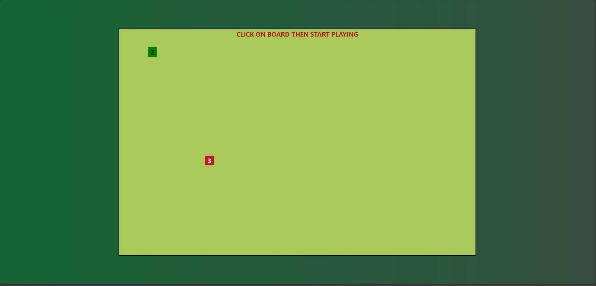
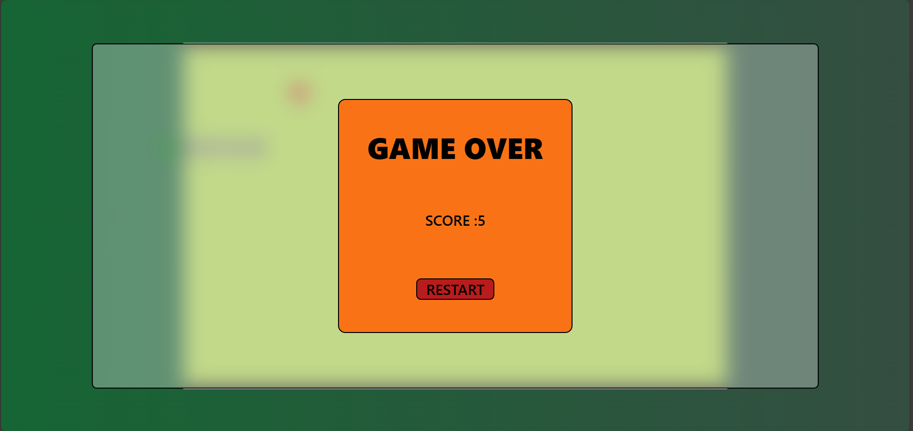

# React Snake Game





## Description

Welcome to the React Snake Game! This is a modern version of the classic Snake game, built using React. Guide your snake to eat food, grow longer, and avoid collisions.

## Table of Contents

- [Features](#features)
- [Demo](#demo)
- [Installation](#installation)
- [Usage](#usage)
- [Folder Structure](#folder-structure)
- [Contributing](#contributing)
- [License](#license)

## Features

- Classic Snake gameplay
- Responsive design
- Dynamic food generation
- Game over and restart functionality
- Keyboard and on-screen button controls

## Demo

A live demo will be available soon. Stay tuned!

## Installation

To run the Snake Game locally, follow these steps:

1. **Clone the repository:**
    ```bash
    git clone https://github.com/yourusername/react-snake-game.git
    cd react-snake-game
    ```

2. **Install dependencies:**
    ```bash
    npm install
    ```

3. **Run the development server:**
    ```bash
    npm run dev
    ```

4. **Open the game in your browser:**
    Open [http://localhost:5173](http://localhost:5173) in your web browser to play the game.

## Usage

### Controls

- **Keyboard:** Use the arrow keys to control the snake.
- **On-Screen Buttons:** Use the on-screen buttons to control the snake on mobile devices.

### Game Play

- **Start the Game:** Click the "Play" button on the landing page.
- **Eat Food:** Guide your snake to the food to grow longer.
- **Avoid Collisions:** Do not collide with the walls or the snake's own body.
- **Restart the Game:** Click the "Restart" button when the game is over.

## Folder Structure

```plaintext
react-snake-game/
├── public/
│   ├── favicon/
│   │   ├── favicon.ico
│   │   ├── favicon-32x32.png
│   │   ├── favicon-16x16.png
│   │   ├── android-icon-72x72.png
│   │   ├── apple-icon-180x180.png
│   │   └── manifest.json
├── src/
│   ├── assets/
│   │   ├── screenshot/
│   │       ├── screenshotGameOver.png
│   │       ├── screenshotLanding.png
│   │   │   └── screenshotPlay.png
│   │   ├── checkred_grass.jpg
│   │   ├── down.png 
│   │   ├── left.png
│   │   ├── right.png
│   │   ├── SN-removebg.png
│   │   └── up.png
│   ├── Components/
│   │   ├── Button.jsx
│   │   ├── Food.jsx
│   │   ├── GameOver.jsx
│   │   ├── Landing.jsx
│   │   └── Snake.jsx
│   ├── App.css
│   ├── App.jsx
│   ├── index.css
│   ├── main.jsx
│
├── .eslintrc.cjs
├── .gitignore
├── package.json
├── package-lock.json
├── postcss.config.js
├── README.md
├── tailwind.config.js
└── vite.config.js
```
# Contributing

First off, thank you for considering contributing to React Snake Game! It's people like you that make open-source projects such a wonderful place to learn, inspire, and create.

Following these guidelines helps to communicate that you respect the time of the developers managing and developing this open-source project. In return, they should reciprocate that respect in addressing your issue, assessing changes, and helping you finalize your pull requests.

## How Can I Contribute?

### Reporting Bugs

This section guides you through submitting a bug report for React Snake Game. Following these guidelines helps maintainers and the community understand your report, reproduce the behavior, and find related reports.

Before creating bug reports, please check the existing list of open issues to see if the problem has already been reported. When you are creating a bug report, please include as many details as possible.

#### How Do I Submit a (Good) Bug Report?

Bugs are tracked as GitHub issues. Create an issue and provide the following information by filling in the template:

- **Title**: A clear and descriptive title for the issue.
- **Description**: A detailed description of the issue and the steps to reproduce it.
- **Expected behavior**: What you expected to happen.
- **Actual behavior**: What actually happened.
- **Screenshots**: If applicable, add screenshots to help explain your problem.
- **Environment**: The environment where the bug was encountered (browser, OS, etc.).

### Suggesting Enhancements

This section guides you through submitting an enhancement suggestion for React Snake Game, including completely new features and minor improvements to existing functionality.

#### How Do I Submit a (Good) Enhancement Suggestion?

Enhancement suggestions are tracked as GitHub issues. Create an issue and provide the following information by filling in the template:

- **Title**: A clear and descriptive title for the suggestion.
- **Description**: A detailed description of the suggested enhancement and why it would be useful.
- **Screenshots**: If applicable, add screenshots to help convey your idea.
- **Additional context**: Any other context or ideas about the feature that might be useful.

### Your First Code Contribution

#### Local Development Setup

1. **Fork the Repository**: Click on the 'Fork' button at the top right of the repository page.

2. **Clone Your Fork**: Clone your fork to your local machine.
    ```bash
    git clone https://github.com/yourusername/react-snake-game.git
    cd react-snake-game
    ```

3. **Install Dependencies**: Install the project dependencies.
    ```bash
    npm install
    ```

4. **Create a Branch**: Create a new branch for your work.
    ```bash
    git checkout -b feature/my-new-feature
    ```

5. **Make Your Changes**: Make your changes to the codebase.

6. **Commit Your Changes**: Commit your changes with a meaningful commit message.
    ```bash
    git add .
    git commit -m 'Add some feature'
    ```

7. **Push to Your Fork**: Push your changes to your fork.
    ```bash
    git push origin feature/my-new-feature
    ```

8. **Create a Pull Request**: Go to the original repository and create a pull request from your forked repository. Provide a clear description of what you have done and why it should be merged.

### Code Style and Testing

- **Code Style**: Ensure that your code adheres to the existing style used in the project. Use consistent indentation, variable naming, and overall coding conventions.
- **Testing**: Test your changes thoroughly. Write unit tests if applicable.

### What to Expect

Maintainers will review your pull request. They may ask for changes to be made before it is merged. This is part of the review process and is meant to improve the quality of the codebase.

## License

This project is licensed under the MIT License - see the `LICENSE` file for details.


## Thank You

Thank you for taking the time to read this guide and contribute to the project! We appreciate your effort and are excited to see what you'll contribute.
